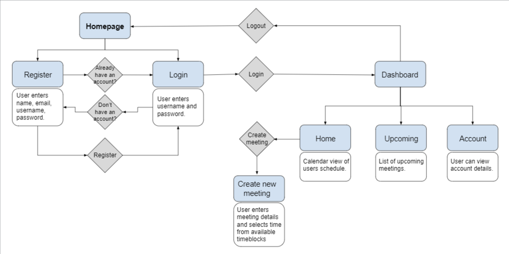

# MeetMe

## How to Run
> ## Project Requirements:
> - [MySQL](https://www.mysql.com/downloads/)
> - [Apache Maven](https://maven.apache.org/download.cgi)

Open the project in NetBeans12.0.

Start the MySQL server and create the database using the script ```meet-me_dump.sql```.

Go to ```DBConnection.java``` and update the connection parameters in the constructor.

Run the project.

## Project Workflow


## Abstract
### Motivation:
Scheduling meetings through email can often be tedious and unreliable as participants must negotiate a time and date that works for everyone. The process of emailing back-and-forth can also lead to miscommunication between participants. Our website will allow users to schedule meetings in a simple and convenient manner.

### The advantage of using a web platform to implement the project:
Because our scheduling system is web-based, this allows end users to access the website and create appointments or meetings at any time of the day. Our website will have an intuitive design to optimize ease of use while offering maximum functionality.

### Project goals and planned outcomes:
To schedule a meeting, the user must input the names of the participants as well as the date in which the meeting will be set. Given the date, the user will be prompted with a list of available time blocks for that day. The user will also have the option to give the meeting a title as well as a subject line or description. Not all meetings are closed meetings, therefore, our site will include the option to make any meeting private or public. Finally, once the user inputs the required information, the system will send an email invitation to each of the attendees.
